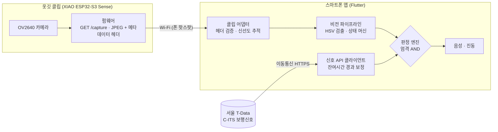

# 🚦 ClipSense

> 실시간 교통신호 데이터와 옷깃 클립 카메라가 **모두 보행 가능을 확인할 때만** 횡단을 안내하는, 시각장애인용 횡단보도 보행 보조 시스템

[](https://github.com/WayMakerSchool/2026-ClipSense-CloseYourMouthandeatBread/actions/workflows/ci.yml)
[](https://waymakerschool.github.io/2026-ClipSense-CloseYourMouthandeatBread/)


**🔗 배포 페이지 (웹 프로토타입)**: https://waymakerschool.github.io/2026-ClipSense-CloseYourMouthandeatBread/  
**🎬 시연 결과 보고서 (2026-10-01)**: [docs/demo/2026-10-01_시연결과.md](docs/demo/2026-10-01_시연결과.md)  
**🛠 시연 운영 가이드 (클립 카메라 고장 시)**: [docs/demo/카메라고장_시연가이드.md](docs/demo/카메라고장_시연가이드.md)  
**🔧 하드웨어 제출서**: [docs/hardware/하드웨어_제출서.md](docs/hardware/하드웨어_제출서.md)

<!-- 대표 이미지나 시연 GIF가 있다면 여기에 넣어주세요. -->

> [!WARNING]
> 연구·교육 목적의 보조 프로토타입입니다. 음향신호기나 사용자의 현장 판단을 대체하지 않으며, 실제 횡단의 유일한 근거로 사용해서는 안 됩니다.

<br>

## 📖 프로젝트 소개

- **기간**: 2026.07.13 ~ 진행 중
- **프로젝트**: 2026 WayMakerSchool 프로젝트 · 2026 모두의 창업 · 제24회 임베디드SW경진대회 자유공모
- **소개**: 2021년 국정감사 자료에 따르면 신호등이 있는 횡단보도 117,484곳 중 음향신호기가 설치된 곳은 39,811곳(34%)에 그칩니다. 나머지 횡단보도에서 시각장애인은 신호의 색도, 남은 시간도 알 수 없습니다.

  ClipSense는 이 문제를 **두 개의 독립된 정보원**으로 풉니다. 서울시 C-ITS 실시간 보행신호 데이터(색·잔여시간)와 옷깃 카메라의 신호등 판독을 매 주기 대조하여, 둘 다 초록이고 남은 시간이 충분하며 두 정보가 모두 최신일 때에만 "지금 건너셔도 됩니다"라고 안내합니다. 어느 하나라도 불확실하면 **이유와 함께** 대기를 안내합니다.

  설계 원칙은 하나입니다. **틀린 초록(false green)을 말하지 않는다.** 놓친 초록은 사용자를 잠시 기다리게 할 뿐이지만, 틀린 초록은 사고로 이어지기 때문입니다.

<br>

## ✨ 주요 기능

| 기능 | 설명 |
| :-- | :-- |
| 이중 검증 판정 | 신호 데이터와 카메라 판독을 엄격한 AND로 결합. 아래 [안전 규칙](#-안전-규칙-safety-contract)을 모두 만족할 때만 보행 안내 |
| 사유 기반 대기 안내 | "초록불이 곧 끝납니다", "안전하게 건널 시간이 부족합니다", "카메라가 신호등을 찾지 못했습니다. 신호등을 향해 주세요" 등 다음 행동을 함께 안내 |
| 실시간 신호 연동 | 서울 T-Data C-ITS API에서 교차로·방향별 보행신호 상태와 잔여시간(0.1초 단위)을 수신하고, 수신 후 경과 시간만큼 잔여시간을 보정 |
| 카메라 신호등 판독 | 학습 모델 없이 HSV 색 검출·형태 검증·상태 머신으로 빨강·초록·점멸을 판독. 오프라인·저사양 동작 |
| 옷깃 클립 카메라 | XIAO ESP32-S3 Sense가 신호등을 촬영해 Wi-Fi HTTP 스냅샷으로 제공. 사용자의 두 손이 자유로움 |
| 장애 상태 검출 | 오래된 데이터, 정지한 영상, 기기 재부팅, 프레임 역전·재전송을 검출해 "확인 불가"로 수렴 |
| 접근성 | 음성(TTS)·진동 안내, GPS 기반 교차로 자동 선택, 스크린리더(TalkBack·VoiceOver) 대응 큰 버튼 UI |
| 펌웨어 시뮬레이터 | 실기기 없이 앱 전 구간을 검증. 프레임 정지·촬영 실패·재부팅·지연 등 장애를 주입하는 표준 라이브러리 기반 HTTP 서버 |
| 웹 프로토타입 | 브라우저에서 모의 신호로 정상·지연·정지·순서 역전 등 결함 시나리오를 재생하며 판정 과정을 시각화 |

<br>

## 🧭 시스템 구조



판정은 스마트폰에서만 수행합니다. 펌웨어는 촬영과 전송만 담당하고 판단하지 않으므로, 안전 규칙은 한 곳(판정 엔진)에서 관리·검증됩니다.

<br>

## 🛡 안전 규칙 (Safety Contract)

보행 안내(`walk`)는 아래 조건을 **모두** 만족할 때만 발생합니다. 그 외 모든 경우는 대기(`wait`) 또는 확인 불가(`unknown`)이며, 사유가 함께 안내됩니다.

| # | 조건 | 기준 | 위반 시 |
| :-: | :-- | :-- | :-- |
| 1 | 신호 데이터가 보행 초록 | API 상태 = 보행 진행 | 대기 (사유 안내) |
| 2 | 카메라 판독이 초록(점멸 아님) | 상태 머신 확정 초록 | 대기 (사유 안내) |
| 3 | 잔여시간이 충분 | API 잔여 ≥ **7초** (카메라 숫자는 더 짧을 때 거부권만 행사) | "안전하게 건널 시간이 부족합니다" |
| 4 | 두 정보가 모두 최신 | 각각 **2초 이내** (네트워크 왕복 지연 포함, 보수적으로 올림) | 확인 불가 |
| 5 | 카메라 영상이 살아 있음 | 3초 이상 새 프레임 없음 = 정지로 판단 | "카메라 영상이 멈췄습니다" |

추가 불변식:

- **추측하지 않는다.** 데이터 누락·파싱 실패·권한 거부·네트워크 오류는 모두 확인 불가로 처리합니다.
- **같은 프레임은 신선도를 갱신하지 않는다.** 순서가 뒤바뀐 프레임은 거부하며, 기기 재부팅(bootId 변경) 시에만 추적 상태를 초기화합니다.
- **규칙은 테스트로 고정된다.** 판정 사례는 언어 중립 골든 파일(`app/test/fixtures/judge_cases.json`)로 정의되어 Dart 앱과 Python 모듈이 동일한 결과를 내야 CI를 통과합니다.

<br>

## 🛠 기술 스택

- **언어**: Dart, Python 3.12, C++ (Arduino), JavaScript
- **프레임워크 / 라이브러리**: Flutter 3.35, React 19 + Vite, OpenCV, `image`, `flutter_tts`, `geolocator`, ESP32 Arduino core 3.3 (`esp32-camera`)
- **하드웨어**: Seeed Studio XIAO ESP32-S3 Sense (OV2640, PSRAM 8MB)
- **데이터**: 서울 T-Data 「신호제어기 신호 잔여시간 정보서비스」 (C-ITS, data_id 10339)
- **도구**: Git, GitHub Actions (CI), GitHub Pages (배포), arduino-cli, VS Code

<br>

## 👥 팀원

|  |  |
| :--: | :--: |
| **임채환 (Dalim)** · 팀장<br>[@daniellim2022](https://github.com/daniellim2022) | **이유찬 (Paul)** · 팀원<br>[@paulschoolwms-hue](https://github.com/paulschoolwms-hue) |
| 기획 · 모바일 앱 · 판정 엔진 · 신호 데이터 연동 · 펌웨어 | 하드웨어 조립 · 현장 측정 · 발표 |

<br>

## ▶️ 실행 방법

### 사전 요구사항

| 대상 | 요구사항 |
| :-- | :-- |
| 웹 프로토타입 | Node.js 20 이상 |
| 모바일 앱 | Flutter 3.35 이상, Android Studio 또는 Xcode, 서울 T-Data API 키 |
| Python 모듈·시뮬레이터 | Python 3.12 (시뮬레이터는 표준 라이브러리만 사용) |
| 펌웨어 | arduino-cli 또는 Arduino IDE, ESP32 core 3.3, XIAO ESP32-S3 Sense |

```bash
# 1. 저장소 받기
git clone https://github.com/WayMakerSchool/2026-ClipSense-CloseYourMouthandeatBread.git
cd 2026-ClipSense-CloseYourMouthandeatBread

# 2. 웹 프로토타입 (API 키 불필요, 모의 신호로 실행)
cd web && npm ci && npm run dev        # http://localhost:5173
npm test && cd ..

# 3. 모바일 앱 (API 키는 코드에 넣지 않고 실행 시 주입)
cd app && flutter pub get && flutter test
flutter run --dart-define=TDATA_KEY="$TDATA_KEY"
#   클립 카메라 사용 시 (같은 네트워크의 기기 주소)
flutter run --dart-define=TDATA_KEY="$TDATA_KEY" --dart-define=CLIP_CAM_HOST=192.168.0.42
cd ..

# 4. 실기기 없이 클립 카메라 검증 (시뮬레이터 + HTTP 계약 검사 24항목)
export CLIP_DEVICE_TOKEN=demo-token
python3 scripts/clip_cam_sim.py --port 8080 &
python3 scripts/check_clip_cam_contract.py http://127.0.0.1:8080
#   장애 주입 예: python3 scripts/clip_cam_sim.py --fault freeze

# 5. 시연 재생 — 실제 신호등 프레임으로 앱 판정 전 과정 (보행 안내 → 시간 부족 → 불일치)
scripts/run_demo_flow.sh                                  # 초록 점등
scripts/run_demo_flow.sh --scene blink                    # 초록 점멸
scripts/run_demo_flow.sh --fault freeze --fault-at 8      # 보행 중 카메라 정지
scripts/run_demo_flow.sh --webcam 0                       # 노트북 카메라를 클립 카메라 대신 (라이브)
python3 scripts/probe_signal_api_live.py 1537 ne          # 서울 T-Data 실서버 1회 진단

# 6. Python 단위·골든 테스트
python3 -m venv .venv && .venv/bin/pip install -r requirements.txt
.venv/bin/python scripts/run_unit_tests.py
```

펌웨어 빌드·업로드는 [firmware/README.md](firmware/README.md), 앱의 카메라 조준·접근성·실기기 점검은 [app/README.md](app/README.md), 부스 데모 운영과 문제 해결은 [상세안내.md](상세안내.md)를 참고하세요.

### 설정과 비밀값

| 이름 | 용도 | 주입 방법 |
| :-- | :-- | :-- |
| `TDATA_KEY` | 서울 T-Data API 키 | `--dart-define` (저장소에 저장 금지) |
| `CLIP_CAM_HOST` | 클립 카메라 주소 | `--dart-define`, 비우면 휴대폰 카메라 사용 |
| `CLIP_CAM_TOKEN` / `CLIP_DEVICE_TOKEN` | 앱·기기 간 접속 토큰 | `--dart-define` / 환경변수 |
| `DEMO_SIGNAL` | 시연용 신호 데이터 (`cycle`: 초록 30초 → 빨강 20초, 화면에 "시연 데이터" 표시) | `--dart-define`, 기본 꺼짐 |
| `firmware/clipsense_cam/secrets.h` | Wi-Fi 정보·기기 토큰 | `secrets.example.h` 복사 후 작성, Git 제외 |

<br>

## ✅ 검증 현황

| 영역 | 검증 방법 | 결과 |
| :-- | :-- | :-- |
| 판정 엔진·앱 | Flutter 자동 테스트 | **578개 통과** (시뮬레이터 연동 2개는 옵트인) |
| Python 모듈 | 단위·골든 테스트 13종 + 펌웨어 계약 정적 검사 | 통과 |
| 클립 카메라 통신 규약 | 시뮬레이터 대상 HTTP 계약 검사 | **24/24 통과** |
| 판정 전 과정 시연 | 실제 신호등 프레임 → 시뮬레이터 → 앱 판정 코드 | 보행·시간 부족·불일치·점멸·카메라 정지 모두 의도대로 ([보고서](docs/demo/2026-10-01_시연결과.md)) |
| 펌웨어 | CI에서 ESP32-S3 대상 컴파일 | 통과 |
| 웹 프로토타입 | Vitest | **378개 통과** |
| 서울 T-Data 연동 | 실서버 호출 (2026-10-01 재확인) | 키·응답 형식 정상. **기존 API가 5분 1회·약 30분 지연으로 바뀌어 실시간 안내 불가 → 신규 API 전환 필요** ([보고서](docs/demo/2026-10-01_시연결과.md#시연-4--서울-t-data-실서버-호출)) |
| 카메라 판독 | 실제 신호등 영상 1편, 그 영상의 모의 변형(야간·역광·흔들림), 합성 영상 | 회귀 테스트 통과 |
| **클립 카메라 실기기** | 보드 플래시·실촬영·지연·배터리 측정 | **미검증** |
| **사용자 현장 시험** | 시각장애인 당사자 참여 시험 | **미실시** |

모든 자동 검증은 `main` 브랜치 push와 Pull Request마다 GitHub Actions에서 실행됩니다. 굵게 표시한 미검증 항목이 다음 단계의 핵심 과제입니다.

### 알려진 한계

- **2026-10-01 서울 T-Data 정책 변경**: 기존 신호 API가 키당 5분 1회 호출, 약 30분 지연 데이터로 바뀌었습니다. 앱은 오래된 데이터를 안전하게 거부하지만, 실시간 안내를 하려면 신규 API(`v2xSignalPhaseTimingFusionCurrentInfo`) 승인과 전환이 필요합니다.
- 실시간 보행신호 데이터를 실측 검증한 지역은 현재 서울뿐입니다. 데이터가 없는 교차로에서는 보행 안내를 하지 않습니다.
- 신호등 자체가 없는 횡단보도(전국 약 54%)는 판독할 신호가 없어 범위 밖입니다.
- 두 정보원이 같은 시점에 같은 방향으로 틀리는 공통 원인 오류는 원리적으로 완전히 배제할 수 없습니다. 잔여시간 조건과 보수적 신선도 기준으로 위험을 줄입니다.

<br>

## 📁 폴더 구조

```
.
├── app/                        # Flutter 모바일 앱
│   ├── lib/
│   │   ├── app/                # 화면, 판정 루프(GuidanceController), 설정, GPS 교차로 선택
│   │   ├── signals/            # T-Data API 클라이언트, 판정 엔진(judge)
│   │   ├── vision/             # 색 검출, 상태 머신, 잔여시간 숫자 판독
│   │   ├── camera/             # 휴대폰 카메라 입력
│   │   ├── clip/               # 클립 카메라 어댑터 (스냅샷 클라이언트, 헤더 파서, 신선도 추적)
│   │   └── feedback/           # 음성·진동 출력
│   └── test/                   # 자동 테스트, 골든 파일, 실영상 fixture
├── firmware/clipsense_cam/     # XIAO ESP32-S3 클립 카메라 펌웨어 (Arduino)
├── web/                        # 웹 프로토타입 (React + Vite), GitHub Pages 배포 원본
├── scripts/                    # 시뮬레이터, 계약 검사, 측정·테스트 러너
├── judge.py, clip_snapshot.py  # 판정·클립 계약의 Python 동등 구현 (골든 파일 공유)
├── main.py, detector.py, ...   # Python 부스 데모 (웹캠 기반 오프라인 시연)
├── assets/voice/               # 오프라인 안내 음성
├── docs/                       # 설계 문서
├── .github/workflows/ci.yml    # Python · Flutter · 펌웨어 CI
├── 상세안내.md                 # 부스 데모 운영, 문제 해결, 심사 Q&A
└── README.md
```

<br>

## 🗺 로드맵

| 단계 | 내용 | 완료 기준 |
| :-- | :-- | :-- |
| 0. 실시간 API 전환 | 신규 API 활용신청·엔드포인트 교체·골든 테스트 갱신 | 실서버 데이터 나이 2초 이내, 실시간 보행 안내 재현 |
| 1. 실기기 검증 | 클립 보드 플래시, 실제 횡단보도 10곳 낮·밤 측정 | 촬영→안내 1초 이내, 배터리 4시간, 틀린 초록 0건 |
| 2. 데이터 확장 | 행정안전부 전국 통합 신호정보 API의 지역별 제공 범위 실측 | 서울 외 교차로 응답 확인 |
| 3. 사용자 검증 | 시각장애인복지관 협력, 보행훈련사 동행 현장 시험 (5~10명) | 틀린 초록 0건, 단독 횡단 성공률·자신감 변화 측정 |
| 4. 제도·보급 | KC 전파 인증, 정보통신보조기기 보급사업 등록 | 인증 완료, 보급 협약 1건 |

<br>

## 🤝 협업 규칙

- **브랜치**
  - `develop`: 개발용 기본 브랜치. 모든 작업은 여기서 시작해요.
  - `feat/기능이름`, `fix/버그이름`: `develop`에서 만들어서 작업하고, PR로 `develop`에 합쳐요.
  - `main`: 발표나 배포할 때만 `develop`을 합쳐요. `main`에 push되면 CI가 전체 검증을 실행해요.
  - `gh-pages`: 웹 프로토타입 빌드 결과물 전용. 직접 수정하지 않아요.
- **커밋 메시지**: `feat: 로그인 기능 추가`, `fix: 버튼 클릭 오류 수정`, `docs: README 수정`
- **리뷰 기준**: 판정 규칙(`judge`)이나 신선도 로직을 바꾸는 PR은 골든 파일과 CI가 모두 통과해야 병합해요. 안전 규칙을 완화하는 변경은 근거(측정 결과)를 PR 본문에 반드시 적어요.
- **비밀값**: API 키, 기기 토큰, `secrets.h`, 서명 키는 커밋하지 않아요. 실수로 커밋했다면 즉시 키를 재발급해요.

<br>

## 📄 라이선스

Copyright © 2026 Team 입닫빵 (임채환, 이유찬). All rights reserved.

오픈소스 라이선스를 지정하지 않았습니다. 코드는 열람할 수 있지만, 팀의 허락 없이 복제·수정·재배포·상업적으로 이용할 수 없습니다. 사용이 필요하면 팀에 문의해 주세요.
