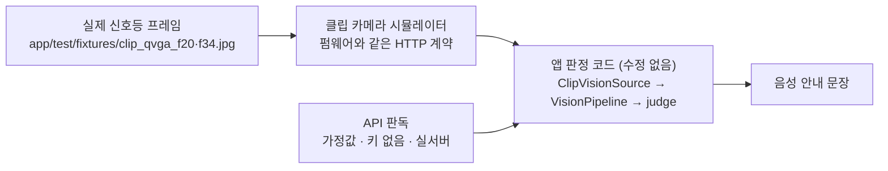

# 시연 결과 보고서 — 2026-10-01

| 항목 | 내용 |
| :-- | :-- |
| 일시 | 2026-10-01 16:00~16:40 (KST) |
| 대상 커밋 | 이 문서가 포함된 커밋 (`main`) |
| 환경 | macOS (Apple Silicon), Flutter 3.35, Python 3.14, 서울 T-Data 개발 계정 |
| 재현 | [`scripts/run_demo_flow.sh`](../../scripts/run_demo_flow.sh), [`scripts/probe_signal_api_live.py`](../../scripts/probe_signal_api_live.py) |

## 요약

1. **판정 흐름은 설계대로 동작했다.** 실제 신호등 프레임을 클립 카메라 통신 규약으로 앱의 실제 판정 코드에 넣었을 때, 보행 안내·잔여시간 부족·신호 불일치·점멸·카메라 정지를 모두 올바른 사유와 함께 안내했다.
2. **실제 서울 T-Data 서버 호출에 성공했다.** 키 인증과 응답 형식(방위별 보행신호 상태·잔여시간)은 기존 구현과 일치했다.
3. **기존 API는 더 이상 실시간 안내에 쓸 수 없다.** 2026-10-01 기준 기존 엔드포인트는 키당 5분에 1회만 허용하고, 응답 데이터가 약 30분 전 등록분이었다. 앱의 신선도 규칙(2초)이 이를 정확히 걸러 보행 안내를 막았다. 실시간 안내에는 서버가 안내한 신규 API로의 전환이 필요하다.

## 시연 구성



- **카메라 입력**: 실제 서울 보행신호등 촬영본에서 펌웨어 기본 프로필(320×240 JPEG)로 추출한 프레임. `f20`은 초록 점등, `f34`는 점멸 중 소등 프레임이다.
- **실기기 아님**: 보드 대신 시뮬레이터가 같은 통신 규약으로 프레임을 낸다. 보드 실촬영은 미검증이다.
- **API 가정값(SCRIPTED)**: 실시간 API를 쓸 수 없어 판정 흐름 검증용으로 "초록 20초에서 실제 시간만큼 감소 후 빨강"을 넣었다. 실측값이 아니며 출력에 `API(가정)`으로 표시된다.

## 시연 1 — 보행 안내 전 과정 (초록 점등 + 가정 API)

```bash
scripts/run_demo_flow.sh --seconds 24
```

```text
시간    API(가정)      카메라            판정      사유
  0.0s  —            —         [starting ] UNKNOWN  API와 카메라 신호를 확인할 수 없습니다
  0.0s  🔊 "카메라를 준비하는 중입니다. 기다리세요"
  0.0s  green 20.0s  unknown   [starting ] WAIT     카메라를 준비하는 중입니다
  1.0s  🔊 "카메라가 신호등을 찾지 못했습니다. 신호등을 향해 주세요. 기다리세요"
  1.0s  green 19.0s  unknown   [streaming] WAIT     카메라가 신호등을 찾지 못했습니다. 신호등을 향해 주세요
  2.0s  🔊 "지금 건너셔도 됩니다, 18초 남았습니다"
  2.0s  green 18.0s  green     [streaming] WALK     API와 카메라가 모두 초록입니다
  3.0s  green 17.0s  green     [streaming] WALK     API와 카메라가 모두 초록입니다
  4.0s  green 16.0s  green     [streaming] WALK     API와 카메라가 모두 초록입니다
  5.0s  green 15.0s  green     [streaming] WALK     API와 카메라가 모두 초록입니다
  6.0s  green 14.0s  green     [streaming] WALK     API와 카메라가 모두 초록입니다
  7.0s  green 13.0s  green     [streaming] WALK     API와 카메라가 모두 초록입니다
  8.0s  green 12.0s  green     [streaming] WALK     API와 카메라가 모두 초록입니다
  9.0s  green 11.0s  green     [streaming] WALK     API와 카메라가 모두 초록입니다
 10.0s  green 10.0s  green     [streaming] WALK     API와 카메라가 모두 초록입니다
 11.0s  green 9.0s   green     [streaming] WALK     API와 카메라가 모두 초록입니다
 12.0s  green 8.0s   green     [streaming] WALK     API와 카메라가 모두 초록입니다
 13.0s  🔊 "안전하게 건널 시간이 부족합니다. 기다리세요"
 13.0s  green 7.0s   green     [streaming] WAIT     안전하게 건널 시간이 부족합니다
 14.0s  green 6.0s   green     [streaming] WAIT     안전하게 건널 시간이 부족합니다
 15.0s  green 5.0s   green     [streaming] WAIT     안전하게 건널 시간이 부족합니다
 16.0s  green 4.0s   green     [streaming] WAIT     안전하게 건널 시간이 부족합니다
 17.0s  green 3.0s   green     [streaming] WAIT     안전하게 건널 시간이 부족합니다
 18.0s  green 2.0s   green     [streaming] WAIT     안전하게 건널 시간이 부족합니다
 19.0s  green 1.0s   green     [streaming] WAIT     안전하게 건널 시간이 부족합니다
 20.0s  🔊 "API와 카메라 신호가 일치하지 않습니다. 기다리세요"
 20.0s  red          green     [streaming] WAIT     API와 카메라 신호가 일치하지 않습니다
 21.0s  red          green     [streaming] WAIT     API와 카메라 신호가 일치하지 않습니다
 22.0s  red          green     [streaming] WAIT     API와 카메라 신호가 일치하지 않습니다
 23.0s  red          green     [streaming] WAIT     API와 카메라 신호가 일치하지 않습니다
 24.0s  red          green     [streaming] WAIT     API와 카메라 신호가 일치하지 않습니다
 24.0s  🔊 "안내를 멈췄습니다. 다시 시작하려면 화면을 한 번 누르세요."
 24.0s  —            —         [idle     ] UNKNOWN  API와 카메라 신호를 확인할 수 없습니다
```

| 구간 | 기대 동작 | 결과 |
| :-- | :-- | :-- |
| 0~1초 | 카메라 확정 전에는 대기 | 통과 — "카메라를 준비하는 중입니다" |
| 2~12초 | 둘 다 초록 · 잔여 ≥ 7초 → 보행 | 통과 — "지금 건너셔도 됩니다, 18초 남았습니다" |
| 13~19초 | 잔여 < 7초 → 대기 | 통과 — "안전하게 건널 시간이 부족합니다" |
| 20초~ | API 빨강 · 카메라 초록 → 대기 | 통과 — "API와 카메라 신호가 일치하지 않습니다" |

## 시연 2 — 초록 점멸 (실제 점등·소등 프레임 교대)

```bash
scripts/run_demo_flow.sh --scene blink --seconds 10
```

```text
시간    API(가정)      카메라            판정      사유
  0.0s  —            —         [starting ] UNKNOWN  API와 카메라 신호를 확인할 수 없습니다
  0.0s  🔊 "카메라를 준비하는 중입니다. 기다리세요"
  0.0s  green 20.0s  unknown   [starting ] WAIT     카메라를 준비하는 중입니다
  1.0s  🔊 "카메라가 신호등을 찾지 못했습니다. 신호등을 향해 주세요. 기다리세요"
  1.0s  green 19.0s  unknown   [streaming] WAIT     카메라가 신호등을 찾지 못했습니다. 신호등을 향해 주세요
  2.0s  🔊 "API와 카메라 신호가 일치하지 않습니다. 기다리세요"
  2.0s  green 18.0s  clearance [streaming] WAIT     API와 카메라 신호가 일치하지 않습니다
  3.0s  green 17.0s  clearance [streaming] WAIT     API와 카메라 신호가 일치하지 않습니다
  4.0s  green 16.0s  clearance [streaming] WAIT     API와 카메라 신호가 일치하지 않습니다
  5.0s  green 15.0s  clearance [streaming] WAIT     API와 카메라 신호가 일치하지 않습니다
  6.0s  green 14.0s  clearance [streaming] WAIT     API와 카메라 신호가 일치하지 않습니다
  7.0s  green 13.0s  clearance [streaming] WAIT     API와 카메라 신호가 일치하지 않습니다
  8.0s  green 12.0s  clearance [streaming] WAIT     API와 카메라 신호가 일치하지 않습니다
  9.0s  green 11.0s  clearance [streaming] WAIT     API와 카메라 신호가 일치하지 않습니다
 10.0s  green 10.0s  clearance [streaming] WAIT     API와 카메라 신호가 일치하지 않습니다
 10.0s  🔊 "안내를 멈췄습니다. 다시 시작하려면 화면을 한 번 누르세요."
 10.0s  —            —         [idle     ] UNKNOWN  API와 카메라 신호를 확인할 수 없습니다
```

API가 초록·잔여 충분이어도 카메라가 점멸(`clearance`)을 확인하면 보행을 안내하지 않았다. 횡단 도중 신호가 끝나는 상황을 카메라가 막는 이중 검증의 핵심 사례다.

## 시연 3 — 보행 중 카메라 정지 주입

```bash
scripts/run_demo_flow.sh --seconds 16 --fault freeze --fault-at 5 --fault-for 6
```

```text
시간    API(가정)      카메라            판정      사유
  0.0s  —            —         [starting ] UNKNOWN  API와 카메라 신호를 확인할 수 없습니다
  0.0s  🔊 "카메라를 준비하는 중입니다. 기다리세요"
  0.0s  green 20.0s  unknown   [starting ] WAIT     카메라를 준비하는 중입니다
  1.0s  🔊 "카메라가 신호등을 찾지 못했습니다. 신호등을 향해 주세요. 기다리세요"
  1.0s  green 19.0s  unknown   [streaming] WAIT     카메라가 신호등을 찾지 못했습니다. 신호등을 향해 주세요
  2.0s  🔊 "지금 건너셔도 됩니다, 18초 남았습니다"
  2.0s  green 18.0s  green     [streaming] WALK     API와 카메라가 모두 초록입니다
  3.0s  green 17.0s  green     [streaming] WALK     API와 카메라가 모두 초록입니다
  4.0s  green 16.0s  green     [streaming] WALK     API와 카메라가 모두 초록입니다
  5.0s  green 15.0s  green     [streaming] WALK     API와 카메라가 모두 초록입니다
  5.0s  ⚡ 장애 주입: freeze
  6.0s  green 14.0s  green     [streaming] WALK     API와 카메라가 모두 초록입니다
  7.0s  🔊 "카메라가 신호등을 찾지 못했습니다. 신호등을 향해 주세요. 기다리세요"
  7.0s  green 13.0s  unknown   [streaming] WAIT     카메라가 신호등을 찾지 못했습니다. 신호등을 향해 주세요
  8.0s  🔊 "카메라 영상이 멈췄습니다. 화면을 두 번 눌러 다시 시작해 주세요. 기다리세요"
  8.0s  green 12.0s  unknown   [stalled  ] WAIT     카메라 영상이 멈췄습니다. 화면을 두 번 눌러 다시 시작해 주세요
  9.0s  green 11.0s  unknown   [stalled  ] WAIT     카메라 영상이 멈췄습니다. 화면을 두 번 눌러 다시 시작해 주세요
 10.0s  green 10.0s  unknown   [stalled  ] WAIT     카메라 영상이 멈췄습니다. 화면을 두 번 눌러 다시 시작해 주세요
 11.0s  green 9.0s   unknown   [stalled  ] WAIT     카메라 영상이 멈췄습니다. 화면을 두 번 눌러 다시 시작해 주세요
 11.0s  ⚡ 장애 해제
 12.0s  🔊 "카메라가 신호등을 찾지 못했습니다. 신호등을 향해 주세요. 기다리세요"
 12.0s  green 8.0s   unknown   [streaming] WAIT     카메라가 신호등을 찾지 못했습니다. 신호등을 향해 주세요
 13.0s  green 7.0s   unknown   [streaming] WAIT     카메라가 신호등을 찾지 못했습니다. 신호등을 향해 주세요
 14.0s  🔊 "안전하게 건널 시간이 부족합니다. 기다리세요"
 14.0s  green 6.0s   green     [streaming] WAIT     안전하게 건널 시간이 부족합니다
 15.0s  green 5.0s   green     [streaming] WAIT     안전하게 건널 시간이 부족합니다
 16.0s  green 4.0s   green     [streaming] WAIT     안전하게 건널 시간이 부족합니다
 16.0s  🔊 "안내를 멈췄습니다. 다시 시작하려면 화면을 한 번 누르세요."
 16.0s  —            —         [idle     ] UNKNOWN  API와 카메라 신호를 확인할 수 없습니다
```

| 지표 | 결과 |
| :-- | :-- |
| 정지 주입 → 보행 안내 중단 | 2초 이내 (7.0s 틱) |
| 정지 주입 → "카메라 영상이 멈췄습니다" | 3초 (8.0s 틱, 정지 감시 기준 3초) |
| 해제 후 | 카메라 재확정 전까지 대기, 이후 잔여시간 규칙으로 대기 유지 |

## 시연 4 — 서울 T-Data 실서버 호출

```bash
python scripts/probe_signal_api_live.py 1537 ne
```

```text
엔드포인트 v2xSignalPhaseTimingFusionInformation · 교차로 1537 · HTTP 200 · 왕복 147ms
레코드 10개 · 전송시각 기준 데이터 나이 2049.5초 · 등록 2026-10-01T07:00:00.000+00:00
  보행 ne: stop-And-Remain · 잔여 0.5초
  보행 se: stop-And-Remain · 잔여 116.5초
  보행 sw: stop-And-Remain · 잔여 0.5초
  보행 nw: stop-And-Remain · 잔여 116.5초
앱 판정 계층 해석(ne): color=UNKNOWN remain=None fresh_ms=2049459  ← 2초보다 오래되어 UNKNOWN
```

같은 키로 5분 안에 다시 호출하면 다음 응답을 받는다(실측, 키 마스킹).

```json
{"status":429,"error":"Too Many Requests","code":"V2X_REPEAT_CALL_LIMIT",
 "api":"v2xSignalPhaseTimingFusionInformation","limitSeconds":300,
 "message":"v2xSignalPhaseTimingFusionInformation API는 최근 호출 후 5분 동안 반복 호출할 수 없습니다. ... 실시간 정보가 필요한 경우 v2xSignalPhaseTimingFusionCurrentInfo API를 이용해 주세요."}
```

| 확인 항목 | 결과 |
| :-- | :-- |
| 키 인증 | 정상 (키 없음 403, 잘못된 키 404, 올바른 키 200·429) |
| 응답 형식 | 기존 구현과 일치 (레코드 배열, `{방위}PdsgStatNm`, `{방위}PdsgRmdrCs` 1/10초) |
| 호출 제한 | **키당 5분 1회** (429 `V2X_REPEAT_CALL_LIMIT`) |
| 데이터 지연 | **약 34분** (등록 07:00 UTC, 호출 07:34 UTC) |
| 앱 해석 | 2초 신선도 규칙에 걸려 `UNKNOWN` — 보행 안내 차단 (의도된 안전 동작) |
| 신규 실시간 API | `v2xSignalPhaseTimingFusionCurrentInfo` — 현재 키로 404, 별도 활용신청 필요로 추정 |

## 결론과 조치

| 우선순위 | 조치 | 담당 | 상태 |
| :-: | :-- | :-- | :-- |
| 1 | T-Data에서 `v2xSignalPhaseTimingFusionCurrentInfo` 활용신청 | 팀장 | 진행 필요 |
| 2 | 승인 후 응답 형식 확인, 앱·Python 엔드포인트 전환, 골든 테스트 갱신 | 개발 | 대기 |
| 3 | 신규 API 호출 한도에 맞춘 폴링 주기·신선도 기준 재검토 | 개발 | 대기 |
| 4 | 클립 보드 실기기로 시연 1~3 재현 (시뮬레이터 → 실보드) | 하드웨어 | 대기 |

> 이 문서의 수치는 2026-10-01 실행 결과다. 시뮬레이터 시연은 판정 로직 검증이며, 실제 도로·실기기 성능을 의미하지 않는다.
