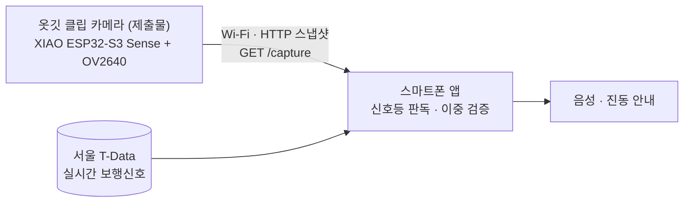

# 하드웨어 제출서 — ClipSense 옷깃 클립 카메라

| 항목 | 내용 |
| :-- | :-- |
| 팀 | 입닫빵 (팀장 임채환, 팀원 이유찬) |
| 제출일 | 2026-10-02 |
| 제출물 | 옷깃 클립 카메라 보드 1개 — Seeed Studio XIAO ESP32-S3 Sense |
| 소스 | [`firmware/clipsense_cam/`](../../firmware/clipsense_cam) (Arduino, ESP32 core 3.3) |
| 저장소 | https://github.com/WayMakerSchool/2026-ClipSense-CloseYourMouthandeatBread |

## 1. 시스템에서의 역할

보드는 앞쪽 보행신호등을 촬영해 Wi-Fi로 사진을 보내는 일만 합니다. **판단은 하지 않습니다.** 안전 규칙(신호 데이터와 카메라가 둘 다 초록일 때만 보행 안내)은 앱 한 곳에서 관리합니다.

## 2. 펌웨어 기능

| 기능 | 구현 |
| :-- | :-- |
| 촬영·전송 | `GET /capture` → 320×240 JPEG + 메타데이터 헤더(프레임 번호, 촬영 시각, 부팅 ID) |
| 상태 확인 | `GET /health` → 카메라 정상 여부, 네트워크 상태, 펌웨어 버전, 최근 오류 |
| 접속 보안 | 모든 데이터 요청에 기기 토큰 필요. 토큰·Wi-Fi 정보는 저장소에 올리지 않는 `secrets.h`에만 보관 |
| 네트워크 | 지정 Wi-Fi(2.4GHz) 접속, 15초 내 실패 시 복구용 자체 AP로 전환 |
| 재부팅 감지 | 부팅마다 바뀌는 `bootId`로 앱이 오래된 시간 기록을 폐기 |
| 촬영 표시 | 촬영 시 보드 LED 점등 (주변인에게 촬영 중임을 알림) |
| 고장 정직성 | 카메라 고장 시 `cameraOk:false`·`503 capture_failed`. 이전 사진을 재전송하지 않음 |

## 3. 현재 상태 (2026-10-02)

| 부분 | 상태 |
| :-- | :-- |
| 보드 본체 | 외관 정상 |
| 카메라 모듈 (OV2640) | **고장** — 교체 또는 커넥터 재장착 필요 |
| 보드 버튼 (BOOT/RESET) | **고장** — 업로드는 USB 자동 진입으로 시도, 재시작은 전원 재연결로 대체 가능 |
| 펌웨어 업로드 | **미실시** — 당일 USB 데이터 케이블 부재 |

## 4. 검증된 것과 검증되지 않은 것

| 항목 | 방법 | 결과 |
| :-- | :-- | :-- |
| 펌웨어 컴파일 | GitHub Actions에서 커밋마다 ESP32-S3 대상 빌드 | 통과 (플래시 30%, RAM 17%) |
| 통신 규약 | 같은 규약을 내는 시뮬레이터에 24개 항목 계약 검사 | 24/24 통과 |
| 앱 연동 | 시뮬레이터에 실제 신호등 프레임·노트북 카메라를 넣어 앱 판정 전 과정 실행 | 보행·시간 부족·불일치·점멸·카메라 정지 모두 의도대로 ([시연 보고서](../demo/2026-10-01_시연결과.md)) |
| 카메라 고장 시 동작 | 펌웨어 코드 경로 확인 (`clipsense_cam.ino` 카메라 실패 후 계속 부팅, `http_api.cpp` 503) | 설계 확인, **실기기 미확인** |
| 실기기 촬영·지연·배터리 | 보드 업로드 후 측정 | **미실시** |

## 5. 기능 시연 (보드 대체)

카메라가 고장 나 보드로 촬영할 수 없으므로, 노트북 카메라를 보드와 **같은 통신 규약**으로 연결해 앱 전체 흐름을 시연합니다. 방법과 명령은 [카메라 고장 시 시연 가이드](../demo/카메라고장_시연가이드.md)에 있습니다.

## 6. 복구 계획

| 순서 | 할 일 | 확인 기준 |
| :-: | :-- | :-- |
| 1 | USB-C 데이터 케이블 확보 → 펌웨어 업로드 | 시리얼 부팅 기록 출력, Wi-Fi 접속 |
| 2 | 카메라 고장 상태에서 고장 감지 확인 | `/health`의 `cameraOk:false`, `/capture` 503, 앱 "기다리세요" |
| 3 | 카메라 커넥터 재장착 또는 OV2640 모듈 교체 | `/health`의 `cameraOk:true` |
| 4 | 실기기 계약 검사·실촬영 측정 | 계약 24/24, 촬영→안내 1초 이내 |

업로드 명령은 [firmware/README.md](../../firmware/README.md)를 따릅니다.
